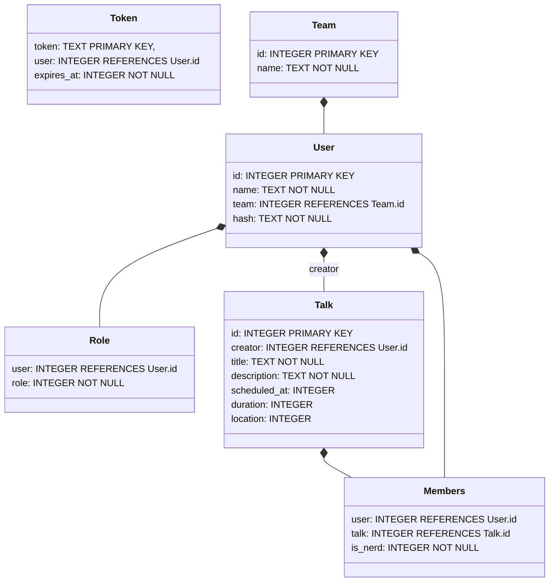

# Moderated Organization PAD (powerful, agile, distributed)

Web application for managing talks (title, description, duration, scheduling).

## How to deploy

Use the example `docker-compose.yaml` of this repository.
You may want to add a reverse proxy for TLS-termination.

Create empty data store with teams `Alpha` and `Bravo`:

```bash
echo '[]' > talks.json
echo '["Alpha", "Bravo"]' > teams.json
echo '{}' > tokens.json
echo '[]' > users.json
```

Then build with `docker compose build mopad` and start the container with `docker compose up -d`.

Navigate to `http://localhost:1337` to view the MOPAD.
The first step is to register yourself by clicking the "Register" link on the login page.
Once registered, you are logged in and can start to manage talks.

## Give Editor and Scheduler roles to users

In MOPAD, users can have roles: `Editor` and `Scheduler`.
They are disjoint which means, users can have multiple roles, one of them, or none.
Normal users do not have any roles.

The `Editor` role allows the user to edit talks created by other users.
Normally users can only edit their own talks.

The `Scheduler` role allows the user to set the scheduling time of talks.
Only schedulers can edit these times.

You can change the roles in the `users.json` file.
Each user has a `"roles"` array field where the roles can be added as string e.g. `"roles": ["Editor", "Scheduler"]`.
Changes made in all JSON files need to be announced to a running server instance by sending it a `SIGUSR1` signal e.g. with `docker compose kill -s SIGUSR1 mopad`.
You can also restart the server but this will disconnect all connected clients (but they should™ reconnect).

## Requirements

- Users can add talks
- Talks initially contain title, description, and intended duration
- All users can register/unregister as noob or nerd on talks
- Users can only register as noob or nerd or nothing at all
- Talks can be scheduled and a location can be set
- Talks should be ordered by schedule time
- Talks should update automatically without user interaction when other users edit them
- Users only edit single fields and changes should be propagated s.t. all users see the most current state and can edit it together
- Operations and permissions
    - Add talk: all users
    - Delete talk: creator and editors
    - Change title, description, duration: creator, editors
    - Change schedule time, location: scheduler
    - Trigger noob/nerd: all users
- Administration tool
    - Reset forgot passwords
    - Change wrong teams
    - Add/remove teams
    - Add/remove users

## Architecture

- Three layered architecture
    - Presentation: HTTP routing and conversion of data, does authentication
    - Application: Transfers updates, does authorization
    - Data: Stores everything and serves it for the application

### Presentation

- WebSocket for triggering and receiving instant updates
- Login page needs list of teams
- iCal

### Application

- Authorization is checked in the server and sent to the client
- Resources
    - Users
    - Teams
    - Talks
- Operations
    - Add talk
    - Delete talk
    - Change title, description, duration
    - Change schedule time, location
    - Trigger noob/nerd
        - User is not registerd, user triggers noob, user will be noob
        - User is not registerd, user triggers nerd, user will be nerd
        - User is noob, user triggers noob, user will be not registered
        - User is nerd, user triggers nerd, user will be not registered
        - User is nerd, user triggers noob, user will be noob
        - User is noob, user triggers nerd, user will be nerd
        - All updates are sent to the users as list of noobs and nerds
    - All changes are broadcasted in realtime to other connected clients

### Data

- Persists in database (SQLite)
- Resources
    - Users
        - Roles
        - Token
    - Teams
    - Talks
        - Noobs
        - Nerds
- Transactions
- Triggers for instant updates


